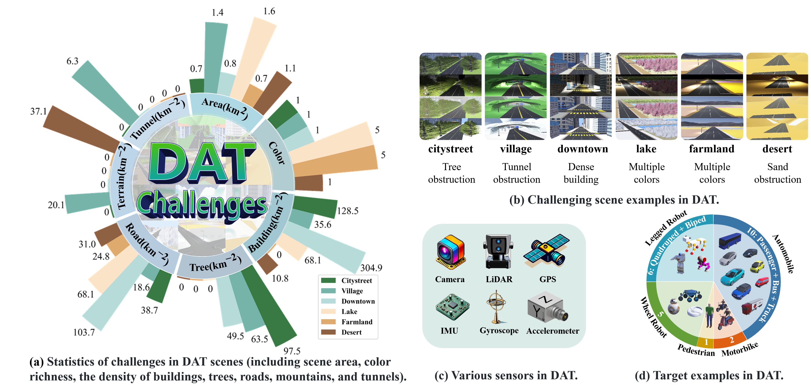

<h2 align="center">A Cross-Scene Benchmark for Open-World Drone Active Tracking</h2>
<h4 align="right">
  by <a href="https://shwplus.github.io/">Haowei Sun* </a>, 
  <a href="https://fhujinwu.github.io/">Jinwu Hu*</a>, 
  <a href="https://github.com/egd060708">Zhirui Zhang</a>,
  <a href="https://github.com/scybd">Haoyuan Tian</a>, 
  <a href="https://olivessora.github.io/">Xinze Xe</a>,<br> 
  <a href="https://wang678.github.io/">Yufeng Wang</a>, 
  <a href="https://scholar.google.com/citations?user=oAUB9cQAAAAJ&hl=en">Zhuliang Yu #</a>, 
  <a href="https://scholar.google.com/citations?user=5YZ3kvoAAAAJ&hl=en&oi=ao">Xiaohua Xie</a>, 
  <a href="https://tanmingkui.github.io/">Mingkui Tan #</a>
</h4>
<!-- # A Cross-Scene Benchmark for Open-World Drone Active Tracking -->

[](LICENSE)
[](https://dat-benchmark.tech/)
[](https://dat-benchmark.tech/zh/index.html)
[](https://dat-benchmark.framer.website/)
[](https://arxiv.org/pdf/2412.00744)




## Abstract
Drone Visual Active Tracking aims to autonomously follow a target object by controlling the motion system based on visual observations, providing a more practical solution for effective tracking in dynamic environments. However, accurate Drone Visual Active Tracking using reinforcement learning remains challenging due to the absence of a unified benchmark, the complexity of open-world environments with frequent interference, and the diverse motion behavior of dynamic targets. To address these issues, we propose a unified cross-scene cross-domain benchmark for open-world drone active tracking called **DAT**. The DAT benchmark provides 24 visually complex environments to assess the algorithms' cross-scene and cross-domain generalization abilities, and high-fidelity modeling of realistic robot dynamics. Additionally, we propose a reinforcement learning-based drone tracking method called **R-VAT**, which aims to improve the performance of drone tracking targets in complex scenarios. Specifically, inspired by curriculum learning, we introduce a Curriculum-Based Training strategy that progressively enhances the agent tracking performance in vast environments with complex interference. We design a goal-centered reward function to provide precise feedback to the drone agent, preventing targets farther from the center of view from receiving higher rewards than closer ones. This allows the drone to adapt to the diverse motion behavior of open-world targets. Experiments demonstrate that the R-VAT has about 400% improvement over the SOTA method in terms of the cumulative reward metric.


## Citation
If you find this project useful, please consider citing our paper
```bibtex
@article{,
  title={A Cross-Scene Benchmark for Open-World Drone Active Tracking},
  author={},
  journal={},
  year={},
  publisher={}
}
```
